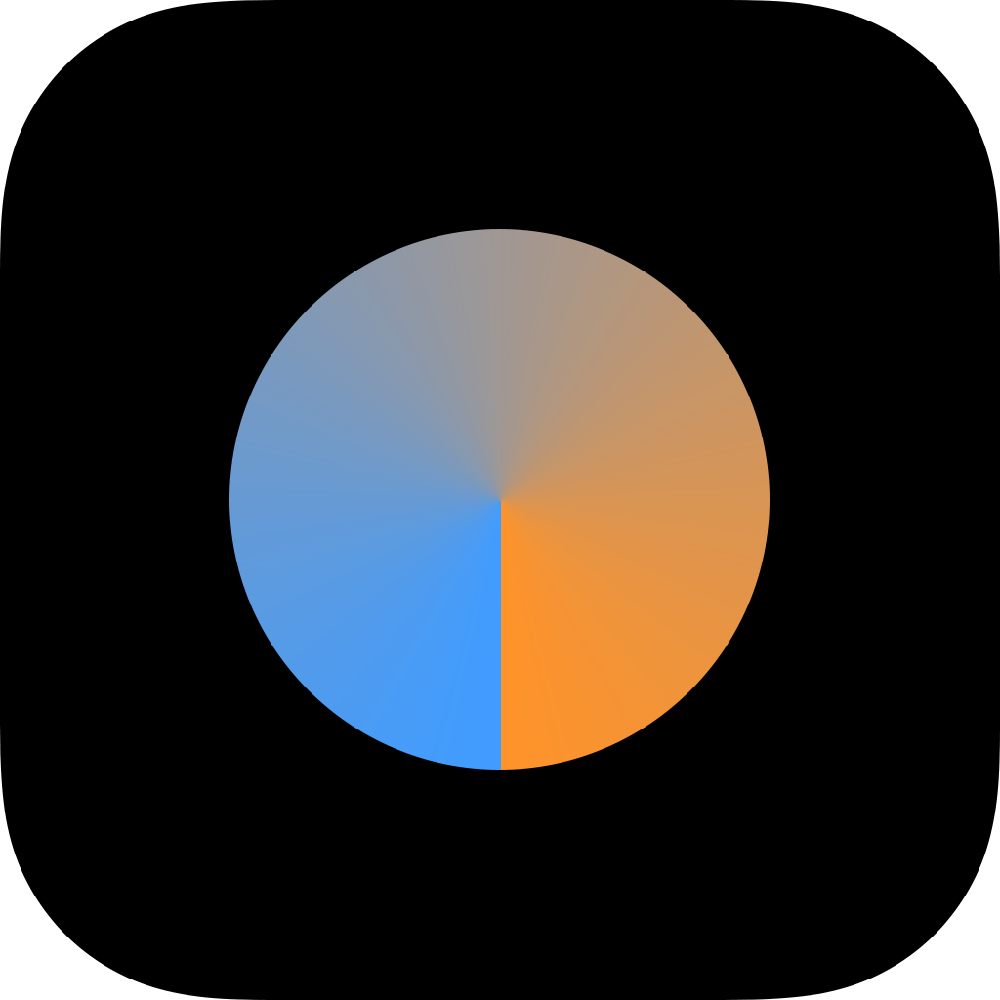
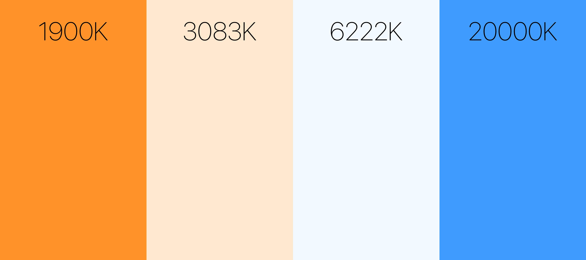

# Lightsy

## About

> Lightsy helps you recording videos and taking photos of yourself at night.
>  It does that by letting you adjust your devices screen to a color that fits the environment you are in. This is accomplished by simply sliding your finger over your devices screen vertically.

> If you have been in a situation where you wanted to record a video of yourself and recognized that the natural light in the environment was just to dark, you probably came up with the idea of using your cell phone's screen as a light booster. That's a great idea! An iPhone screen represents an almost perfectly illuminated light panel like you would know from professional movie sets. But it has an issue. As not every environment is the same, you would end up getting your face lit up in a different tone as you can't adjust your phones white tone. With Lightsy you can. Just open Lightsy and slide your finger accross the screen until the color suits you perfectly.

## Here is how it works

### Overview of the colors
As of right now there is now public API from Apple that allows us developers to access the color temperature of a device's screen like Night Shift (introduced in iOS 9.3) does. We can only simulate it by setting the `backgroundColor` of an `UIView` object to a color that comes close the what it would look like in real life. If you want to learn more about it, checkout this site I stumbled upon and found really helpful. It's also the site I took the color values for Lightsy from: [http://planetpixelemporium.com/tutorialpages/light.html](http://planetpixelemporium.com/tutorialpages/light.html)

Here is an excerpt of four of the colors of the entire spectrum Lightsy can display:

### How you can interact with Lightsy
It's as simple as sliding your finger vertically on the screen to change the color temperature.

## Setup
For dependency management, [CocoaPods](https://github.com/CocoaPods/CocoaPods) is being used. As the `Pods` folder is not included, installing [CocoaPods](https://github.com/CocoaPods/CocoaPods) and the dependencies with it is required to run the project.

If you haven't installed it on your system yet, continue with the following steps:

1. `sudo gem install cocoapods`
 - will ask for your password
2. `pod setup`
 - sets up CocoaPods master repository
3. `cd [wherever you cloned Lightsy]/Lightsy`
 - basically `cd` to the folder in which lies the Podfile of Lightsy
4. `pod install`
 - installs dependencies

## Future
- [ ] macOS App

## Author
Fabian Ehlert, [fabian@fabianehlert.com](mailto:fabian@fabianehlert.com)

## License
Lightsy is available under the MIT license. See the LICENSE file for more info.
